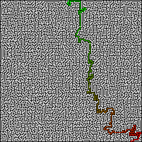

# Maze Solving Using Python and BFS algoritn

Maze Solving program written in python based on BFS algorithm. 

# Image maze solving

The program can take a maze like this as an input.It uses PIL library to convert a image into a pattern of "+","-","S" and "E" and solves it. 
 

After solving the maze it creates a new image named <b>solution.png</b> 

